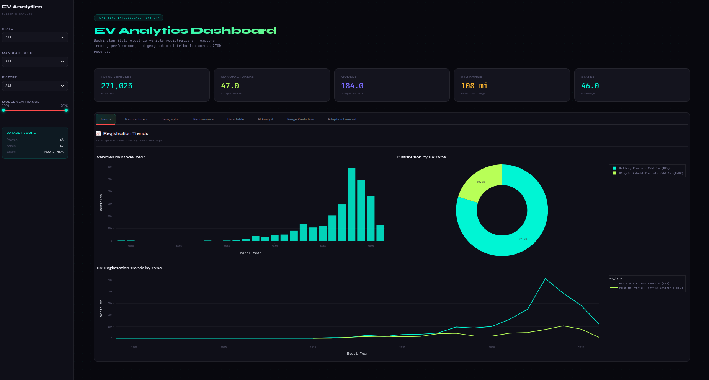
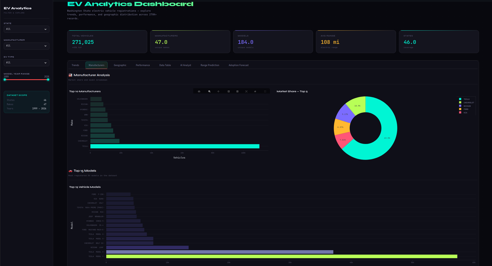
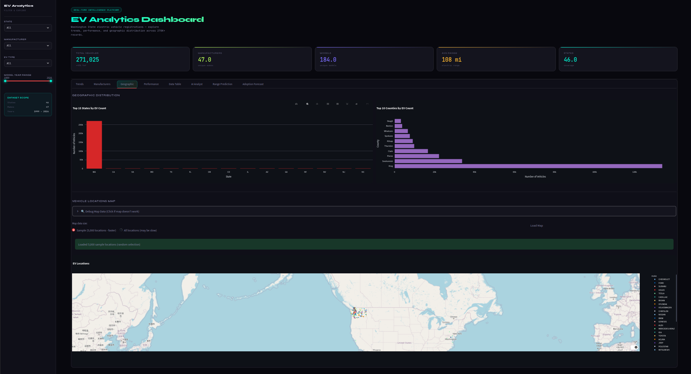
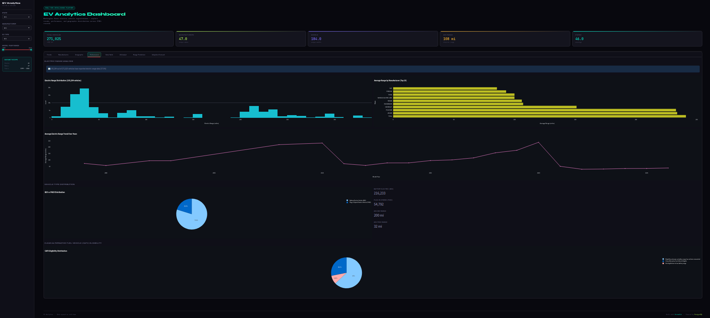
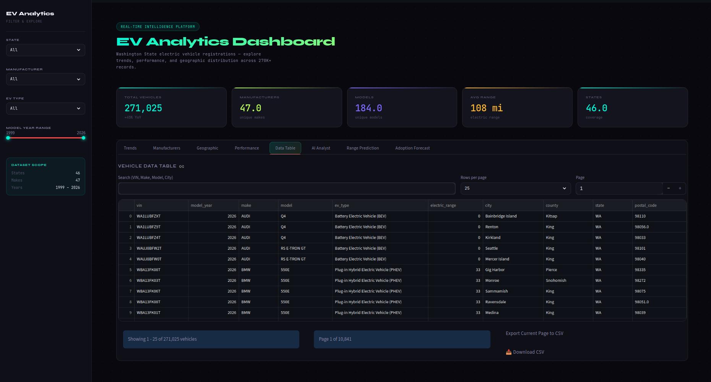
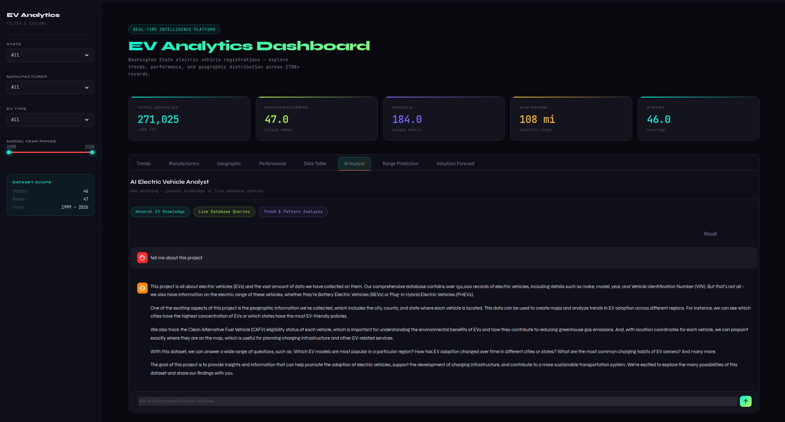
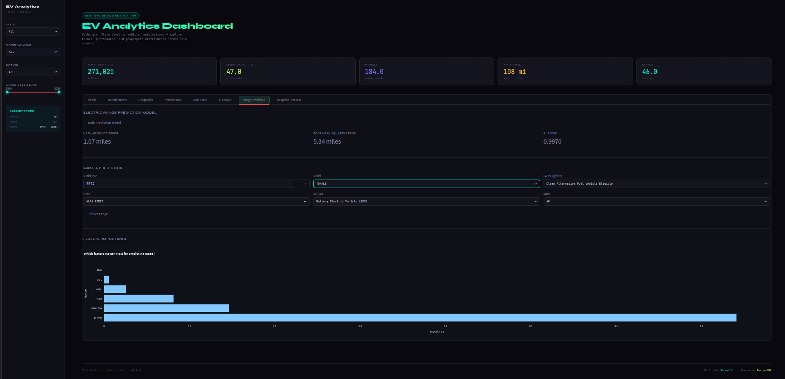
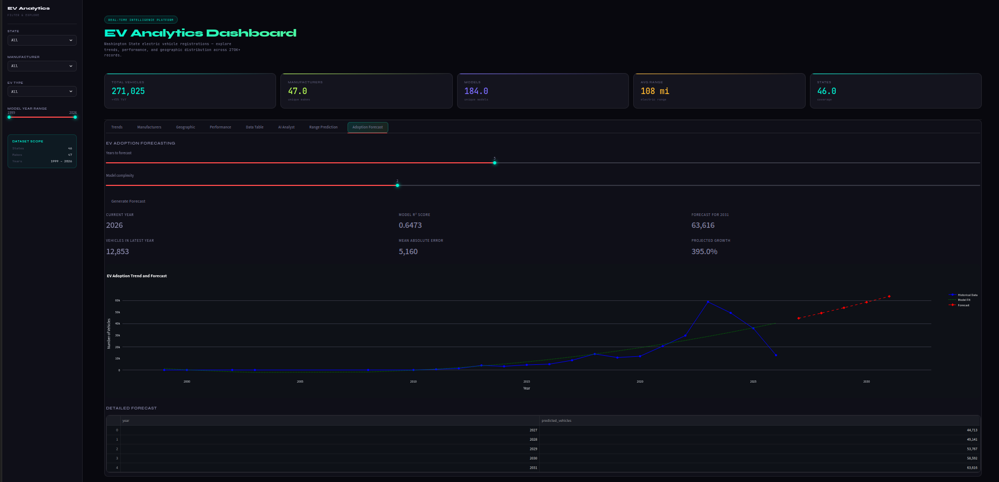

# Electric Vehicle Dataset Insight

<div align="center">

[](https://www.postgresql.org/)
[](https://www.python.org/)
[](https://streamlit.io/)
[](https://groq.com/)
[](https://scikit-learn.org/)

**A comprehensive end-to-end data engineering and analytics platform for electric vehicle analysis**

[Features](#-features) • [Quick Start](#-quick-start) • [Architecture](#️-architecture) • [Documentation](#-project-structure)

</div>

---

## 🎯 Overview

EV-DATASET-INSIGHT is a complete data platform for analyzing electric vehicle datasets, featuring automated ETL pipelines, interactive visualizations, AI-powered natural language queries, and predictive machine learning models.

**Key Capabilities:**
- 🗄️ **PostgreSQL + PostGIS** - Robust data storage with geospatial support
- 🔄 **Automated ETL Pipeline** - Data quality checks and validation
- 📊 **Interactive Dashboard** - 8 comprehensive analysis tabs with real-time filtering
- 🤖 **Intelligent AI Chatbot** - Natural language queries with SQL auto-generation
- 🗺️ **Geospatial Analysis** - Interactive mapping with coordinate debugging tools
- 🔮 **ML Predictions** - Range prediction and adoption forecasting models

---

## ✨ Features

### Database & ETL
- **Normalized Relational Schema** - Referential integrity and optimized queries
- **Automated Migrations** - Using sync-db for version control
- **PostGIS Integration** - Geographic queries and spatial indexing
- **SQL Stored Procedures** - Efficient data transformation
- **Complete ETL Pipeline** - Extract, transform, load with validation
- **Data Quality Checks** - Automated validation and error handling

### Analytics Dashboard
- 📈 **Trends Analysis** - Registration patterns and time-series analysis
- 🏭 **Manufacturer Insights** - Market share, top models, and brand comparison
- 🗺️ **Geographic Distribution** - State/county analysis with interactive maps
  - Built-in map debugging tool
  - Support for both PostGIS and standard POINT formats
  - Coordinate validation and error diagnostics
- ⚡ **Performance Metrics** - Electric range comparisons and CAFV eligibility
- 📋 **Data Explorer** - Searchable table with pagination and CSV export
- 🤖 **AI Analyst** - Natural language queries with intelligent routing
- 🔮 **Range Prediction** - ML model for predicting vehicle range
- 📊 **Adoption Forecast** - Polynomial regression for future trends

### AI & Machine Learning
- 🧠 **Intelligent Chatbot** - Hybrid AI system using Groq AI (Llama 3.3 70B)
  - Auto-classifies questions (general knowledge / database queries / hybrid)
  - Generates SQL from natural language
  - Transparent SQL display
  - Conversational responses
  - Sub-3-second response time
- 🎯 **Random Forest** - Range prediction model with feature importance
- 📈 **Polynomial Regression** - Adoption forecasting with customizable complexity

### Interactive Visualizations
- **Real-time Filtering** - Dynamic updates across all visualizations
- **Plotly Charts** - Interactive, responsive visualizations
- **Custom Color Schemes** - Professional, accessible color palettes
- **Export Capabilities** - Download data and charts
- **Responsive Design** - Works on desktop and mobile

---

## 📸 Dashboard Screenshots

### 📊 Analytics Overview

*Summary metrics with total vehicles, manufacturers, models, and average range*

### 🏭 Manufacturer Insights

*Top manufacturers, market share analysis, and model rankings*

### 🗺️ Geographic Distribution

*Interactive map with state/county distribution and built-in debugging tools*

### ⚡ Performance Metrics

*Range distribution, manufacturer comparison, and year-over-year trends*

### 📋 Data Explorer

*Searchable, paginated data table with advanced filtering*

### 🤖 AI Chatbot

*Natural language queries with SQL transparency and conversational responses*

### 🔮 Range Prediction

*ML-powered range prediction with feature importance analysis*

### 📊 Adoption Forecast

*Future adoption trends using polynomial regression*

---

## 🏗️ Architecture

### System Overview

```
┌─────────────────────────────────────────────────────────────────────────────┐
│                          SYSTEM ARCHITECTURE                                │
└─────────────────────────────────────────────────────────────────────────────┘

    ┌──────────────────┐
    │   Data Sources   │
    │   • APIs         │
    └────────┬─────────┘
             │
             ▼
    ┌─────────────────────────┐
    │    ETL PIPELINE         │
    ├─────────────────────────┤
    │  1. Extract  ────────▶  │ • Data validation
    │  2. Transform ───────▶  │ • Quality checks
    │  3. Load  ──────────▶   │ • Error handling
    └────────┬────────────────┘
             │
             ▼
┌────────────────────────────────────────────────────────────────────┐
│                   POSTGRESQL DATABASE (PostGIS)                    │
├────────────────────────────────────────────────────────────────────┤
│                                                                    │
│  ┌──────────────┐  ┌──────────────┐  ┌──────────────┐              │
│  │    model     │  │   location   │  │   vehicle    │              │
│  │              │  │              │  │              │              │
│  │ • model_id   │  │ • location_id│  │ • vehicle_id │              │
│  │ • make       │  │ • city       │  │ • vin        │              │  
│  │ • model      │  │ • state      │  │ • model_id   │              │
│  │              │  │ • county     │  │ • location_id│              │
│  │              │  │ • lat/lon    │  │ • model_year │              │
│  │              │  │ • postal_code│  │ • ev_type    │              │
│  └──────────────┘  └──────────────┘  └──────────────┘              │
│                                                                    │
│  ┌──────────────────────────────────────────────────┐              │
│  │        electric_vehicles (Staging)               │              │
│  │  • Raw data before normalization                 │              │
│  │  • Supports incremental loads                    │              │
│  └──────────────────────────────────────────────────┘              │
│                                                                    │
└─────────────────────────┬──────────────────────────────────────────┘
                          │
                          ▼
                    ┌──────────────────┐
                    │   Streamlit      │
                    │   Dashboard      │
                    │                  │
                    │ • 8 Tabs         │
                    │ • ML Models      │
                    │ • Filters        │
                    │ • AI Chatbot     │
                    └──────────────────┘
```

### Data Flow

```
┌─────────────────────────────────────────────────────────────────────┐
│                         DATA FLOW DIAGRAM                           │
└─────────────────────────────────────────────────────────────────────┘

  Raw Data          ETL Pipeline              Database              Application
     │                   │                        │                      │
     │                   │                        │                      │
┌────▼────┐         ┌────▼────┐            ┌─────▼──────┐        ┌─────▼──────┐
│   API   │  ─────▶ │ Extract │  ────────▶ │  Staging   │  ────▶ │  Dashboard │
│         │         │ Validate│            │   Table    │        │            │
└─────────┘         └─────────┘            └─────┬──────┘        │ • Trends   │
                          │                      │               │ • Geo Map  │
                          │                      │               │ • AI Chat  │
                          ▼                      ▼               │ • ML Models│
                    ┌──────────┐           ┌──────────┐          └────────────┘
                    │Transform │  ───────▶ │   model  │
                    │  Clean   │           │ location │
                    │ Normalize│           │ vehicle  │
                    └──────────┘           └──────────┘
                          │                      │
                          │                      │
                          ▼                      ▼
                    ┌──────────┐           ┌──────────┐
                    │   Load   │  ───────▶ │ Indexed  │
                    │ Reference│           │   Data   │
                    └──────────┘           └────┬─────┘
                                                 │
                                                 ▼
                                          ┌─────────────┐
                                          │ AI Chatbot  │
                                          │  (Groq AI)  │
                                          │ + SQL Gen   │
                                          └─────────────┘
```

---

## 📁 Project Structure

```
EV-DATASET-INSIGHT/
│
├── 📁 db/                                   Database Layer
│   ├── 📁 src/
│   │   │
│   │   ├── 📁 migrations/                   Database Schema Migrations
│   │   │   ├── 20260120041542_create_table_electric_vehicles.down.sql
│   │   │   ├── 20260120041542_create_table_electric_vehicles.up.sql
│   │   │   ├── 20260125102300_create_table_model.down.sql
│   │   │   ├── 20260125102300_create_table_model.up.sql
│   │   │   ├── 20260125102312_create_table_location.down.sql
│   │   │   ├── 20260125102312_create_table_location.up.sql
│   │   │   ├── 20260125102332_create_table_vehicle.down.sql
│   │   │   ├── 20260125102332_create_table_vehicle.up.sql
│   │   │   ├── 20260127062000_create_table_std_electric_vehicles.down.sql
│   │   │   └── 20260127062000_create_table_std_electric_vehicles.up.sql
│   │   │
│   │   ├── 📁 scripts/                      ETL Pipeline Scripts
│   │   │   ├── 📁 util/
│   │   │   │   ├── __init__.py
│   │   │   │   └── db_connection.py         Database connector
│   │   │   ├── __init__.py
│   │   │   ├── extract.py                   Data extraction from API
│   │   │   ├── transform.py                 Data cleaning & validation
│   │   │   └── load.py                      Data loading to PostgreSQL
│   │   │
│   │   └── 📁 sql/
│   │       ├── 📁 procedure/                Stored Procedures
│   │       │   ├── load_location.sql        Location data loader
│   │       │   ├── load_model.sql           Model data loader
│   │       │   ├── load_vehicle.sql         Vehicle data loader
│   │       │   └── transform_electric_vehicle.sql  Data transformation
│   │       └── 📁 view/                     SQL Views
│   │
│   ├── 📝 README.md                         Database documentation
│   ├── __init__.py
│   ├── 📄 connection-resolver.js            DB connection config
│   ├── main.py                              ETL orchestrator
│   ├── ⚙️ package.json                      Node dependencies
│   ├── ⚙️ sync-db.yml                       Migration config
│   └── 📦 yarn.lock                         Dependency lock file
│
├── 📁 visualization/                        Streamlit Dashboard & AI Layer
│   │
│   ├── 📁 chatbot/                          AI Intelligence Layer
│   │   └── intelligent_chatbot.py           Hybrid AI chatbot (Groq AI + SQL)
│   │
│   ├── 📁 components/                       UI Components
│   │   ├── 📁 tabs/                         Dashboard Features
│   │   │   ├── __init__.py
│   │   │   ├── ai_analyst.py                AI-powered natural language queries
│   │   │   ├── data_table.py                Searchable vehicle data table
│   │   │   ├── forecast.py                  Adoption forecasting
│   │   │   ├── geographic.py                Interactive maps & location analysis
│   │   │   ├── manufacturers.py             Market share & brand analysis
│   │   │   ├── performance.py               Range & performance metrics
│   │   │   ├── prediction.py                ML-based range prediction
│   │   │   └── trends.py                    Registration trends over time
│   │   ├── __init__.py
│   │   ├── metrics.py                       Dashboard KPIs
│   │   └── sidebar.py                       Navigation sidebar
│   │
│   ├── 📁 config/                           Application Configuration
│   │   ├── __init__.py
│   │   └── page_config.py                   Streamlit page setup
│   │
│   ├── 📁 utils/                            Helper Utilities
│   │   ├── __init__.py
│   │   ├── chart_theme.py                   Shared chart styling and color theme
│   │   ├── data_loader.py                   SQL queries & data fetching
│   │   ├── database.py                      PostgreSQL connection handler
│   │   ├── map_debug.py                     Map visualization helpers
│   │   └── ml_models.py                     ML training & prediction
│   │
│   ├── app.py                               Main Streamlit application
│   ├── test_chatbot.py                      Chatbot test suite
│   ├── verify_setup.py                      Setup verification script
│   └── 📝 README.md                         Visualization documentation
│
├── 📁 image/                                Screenshots & Documentation
│   ├── 🖼️ Adoption.png                      Adoption forecast screenshot
│   ├── 🖼️ Chatbot.png                       AI analyst screenshot
│   ├── 🖼️ DataTable.png                     Data table screenshot
│   ├── 🖼️ GeoDistribution.png               Geographic map screenshot
│   ├── 🖼️ Manufacturer.png                  Manufacturer analysis screenshot
│   ├── 🖼️ Overview.png                      Dashboard overview
│   ├── 🖼️ RangePrediction.png               Range prediction screenshot
│   └── 🖼️ evRange.png                       Performance metrics screenshot
│
├── ⚙️  Configuration Files (Root)
│   ├── .env                                 Environment variables (DB, API keys)
│   ├── .gitignore                           Git ignore patterns
│   ├── requirements.txt                     Python dependencies
│   └── workflow.txt                         Development workflow notes
│
└── 📝 README.md                             Main project documentation
```

---

## 🏗️ Architecture Layers

### Layer 1: Data Layer (`db/`)
**Purpose:** Data storage, ETL pipeline, database management

**Key Components:**
- **Migrations:** Version-controlled schema changes
- **ETL Scripts:** Extract → Transform → Load pipeline
- **Stored Procedures:** Optimized data loading routines
- **Database:** PostgreSQL with PostGIS for location data

**Tables:**
- `vehicle` - Main EV records (150K+ rows)
- `model` - Make & model information
- `location` - Geographic data with coordinates

---

### Layer 2: Application Layer (`visualization/`)
**Purpose:** User interface, analytics, visualization

**Key Components:**

#### 2.1 UI Components (`components/`)
- **Tabs:** 8 specialized analysis modules
- **Metrics:** Dashboard KPIs and statistics
- **Sidebar:** Navigation and filters

#### 2.2 Utilities (`utils/`)
- **data_loader.py:** All SQL queries centralized
- **database.py:** Connection pooling & management
- **ml_models.py:** Machine learning models
- **map_debug.py:** Geographic visualization helpers

#### 2.3 Configuration (`config/`)
- **page_config.py:** Streamlit styling and layout

---

### Layer 3: AI Intelligence Layer (`chatbot/`)
**Purpose:** Natural language interface to data

**Key Component:**
- **intelligent_chatbot.py:** Hybrid AI system
  - Classifies questions (general/data/hybrid)
  - Generates SQL from natural language
  - Uses Groq AI (Llama 3.3 70B)
  - Provides conversational responses
  - Shows SQL queries used
  - Displays raw data results

**Flow:**
```
User Question → Classify → [General Knowledge | SQL Generation | Both] → Answer
```

---

## 🛠️ Technology Stack

```
┌─────────────────────────────────────────────────────────────────┐
│                      TECHNOLOGY STACK                           │
└─────────────────────────────────────────────────────────────────┘

Database Layer              Backend Layer              Frontend Layer
┌──────────────┐           ┌──────────────┐           ┌──────────────┐
│ PostgreSQL   │           │ Python 3.8+  │           │ Streamlit    │
│    12+       │◀─────────▶│              │◀─────────▶│   1.28+      │
│              │           │ • pandas     │           │              │
│ PostGIS 3.0+ │           │ • psycopg2   │           │ Plotly 5.17+ │
│              │           │ • NumPy      │           │              │
│ Point/       │           │ • scikit-    │           │ • Folium     │
│ Geometry     │           │   learn      │           │ • Charts     │
└──────────────┘           └──────────────┘           └──────────────┘
       │                          │                          │
       │                          │                          │
       └────────────┬─────────────┴──────────────┬───────────┘
                    │                            │
                    ▼                            ▼
            ┌──────────────┐           ┌──────────────────┐
            │  Migration   │           │   AI/ML Layer    │
            │              │           │                  │
            │  sync-db     │           │  • Groq AI       │
            │  Node.js 14+ │           │    (Llama 3.3)   │
            │  Yarn        │           │  • scikit-learn  │
            │              │           │  • SQL Gen       │
            └──────────────┘           └──────────────────┘

Dependencies:
├── Data Processing: pandas, numpy, psycopg2-binary
├── Visualization: streamlit, plotly, folium
├── ML/AI: scikit-learn, groq, python-dotenv
└── Database: PostgreSQL 12+, PostGIS 3.0+
```

---

## 🚀 Quick Start

### Prerequisites

- Python 3.8+
- PostgreSQL 12+ with PostGIS extension
- Node.js 14+ and Yarn
- Git
- Groq API Key

### Installation

**1. Clone repository**
```bash
git clone https://github.com/Aron0821/ev-dataset-insight.git
cd ev-dataset-insight
```

**2. Set up virtual environment**
```bash
python -m venv venv
source venv/bin/activate  # Windows: venv\Scripts\activate
```

**3. Install dependencies**
```bash
# Node.js for migrations
cd db
yarn install

# Python packages
cd ..
pip install -r requirements.txt
```

**4. Configure environment**
```bash
# Create .env file in project root
cp .env_example .env

```

**5. Set up database**
```bash
# Create database
createdb DB_NAME

# Enable PostGIS
psql ev_db -c "CREATE EXTENSION postgis;"

# Run migrations
cd db
yarn sync-db synchronize
```

**6. Run ETL pipeline**
```bash
cd db
python main.py
# Select: 4 (All - Extract, Transform, Load)
```

**7. Launch dashboard**
```bash
cd visualization
streamlit run app.py
# Dashboard opens at: http://localhost:8501
```

---

## 📊 Dashboard Features

### 1. Trends Analysis
- Vehicle registration patterns by year
- EV type distribution (BEV vs PHEV)
- Time-series trend analysis
- Interactive filtering by state, make, model year

### 2. Manufacturer Insights
- Top 10 manufacturers by market share
- Top 15 vehicle models
- Market concentration analysis
- Brand performance comparison

### 3. Geographic Distribution
- State and county-level analysis
- Interactive map with vehicle locations
- Sample or full dataset mapping options
- Built-in coordinate debugging tools

### 4. Performance Metrics
- Electric range distribution
- Range by manufacturer
- Year-over-year range trends
- BEV vs PHEV comparison
- CAFV eligibility analysis

### 5. Data Explorer
- Searchable, paginated data table
- Multi-field search (VIN, make, model, city)
- CSV export functionality
- Real-time filtering

### 6. AI Analyst
- **Natural language queries** - Ask questions in plain English
- **Intelligent routing** - Auto-classifies questions (general/data/hybrid)
- **SQL auto-generation** - Converts questions to SQL automatically
- **Transparent** - Shows SQL queries used
- **Conversational responses** - Natural, easy-to-understand answers
- **Fast** - Sub-3-second response time

**Example Questions:**
```
"What is an electric vehicle?"
"How many Tesla vehicles are in the database?"
"What is CAFV eligibility and how many qualify?"
"Show me the top 5 manufacturers"
"What's the average electric range by year?"
```

### 7. Range Prediction
- Random Forest regression model
- Feature importance analysis
- Predict range based on:
  - Model year
  - Make/model
  - EV type
  - State
  - CAFV eligibility

### 8. Adoption Forecast
- Polynomial regression forecasting
- Customizable prediction horizon (1-10 years)
- Adjustable model complexity
- Historical vs predicted visualization

---

## 🤖 AI Chatbot Details

### How It Works

The intelligent chatbot uses a **3-step process**:

**Step 1: Question Classification**
```
User asks: "What is CAFV and how many vehicles qualify?"
                    ↓
AI classifies as: HYBRID (needs both knowledge + data)
```

**Step 2: Information Gathering**
```
For HYBRID questions:
├─ Get general knowledge from Groq AI
└─ Generate and execute SQL query
    SELECT COUNT(*) FROM vehicle WHERE cafv_eligible = 'Clean Alternative Fuel Vehicle Eligible'
```

**Step 3: Response Generation**
```
Combine both sources:
"CAFV stands for Clean Alternative Fuel Vehicle, which qualifies for 
incentives like carpool lane access. In our database, 89,450 vehicles 
(59%) are CAFV eligible."
```

### Key Features

✅ **Three Query Types:**
- **General** - EV knowledge (no database needed)
- **Data Query** - SQL generation and execution
- **Hybrid** - Combines both approaches

✅ **Transparent:**
- Shows SQL queries used
- Displays raw data results
- Explains query type

✅ **Fast & Free:**
- Sub-3-second responses
- Uses free Groq AI (Llama 3.3 70B)
- No API costs

✅ **Error Handling:**
- Automatic transaction rollback
- Database health checks
- Refresh button for connection reset

---

## 🔧 Configuration

### Environment Variables (.env)

```bash
# Database
DB_HOST=localhost
DB_PORT=5432
DB_NAME=ev_db
DB_USER=your_username
DB_PASSWORD=your_password

# Dataset
API_URL=https://data.wa.gov/resource/f6w7-q2d2.csv

# AI/ML
GROQ_API_KEY=your_groq_api_key
```

## 🔄 ETL Pipeline Details

### Extract
- Reads CSV data from API
- Validates data structure
- Handles missing values
- Logs extraction statistics

### Transform
- Cleans and normalizes data
- Creates POINT geometries for PostGIS
- Validates data types
- Removes duplicates
- Standardizes formats

### Load
- Loads to staging table (`electric_vehicles`)
- Calls stored procedures for normalization
- Creates `model`, `location`, `vehicle` records
- Maintains referential integrity
- Handles conflicts with upsert logic

---


## 🎯 Project Highlights

✅ **Clean Architecture:** Modular, maintainable, scalable  
✅ **AI-Powered:** Intelligent chatbot with Groq AI (Llama 3.3)  
✅ **Comprehensive Analytics:** 8 specialized modules  
✅ **Interactive Visualizations:** Charts, maps, tables  
✅ **ML Capabilities:** Range prediction, forecasting  
✅ **Production-Ready:** Error handling, testing, documentation  
✅ **Free AI:** No API costs (Groq free tier)  
✅ **Transparent:** Shows SQL queries and raw data  

---

## 🧪 Testing

```bash
# Test chatbot functionality
cd visualization
python test_chatbot.py

# Verify setup
python verify_setup.py
```
